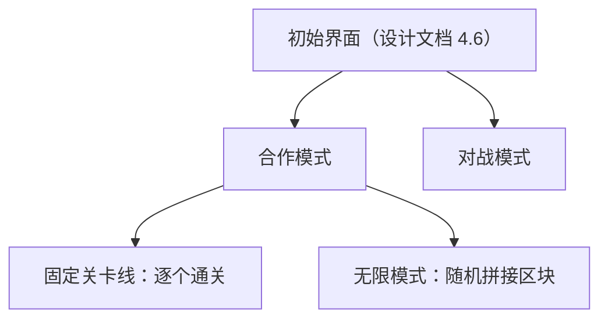

# 熔霜 · 机制与玩法设计

> 日期：2026-09-30
> 来源：本文档由 `玩法灵感.md` 整理并拓展而来。原稿是一份不做分类、不标轻重的灵感清单，本文档只做三件事：**归类**、**把每条从"想法"写成"规则"**、**把原稿没给结论的地方明确标成待定**。
> 原稿继续保留为灵感池，新增灵感仍先写进 `玩法灵感.md`，再择要合并到这里。
> 与既有文档的关系：`熔霜-游戏设计文档.md` 定的是产品方向、平台与选型；`玩法方案库.md` 是可选的备选玩法储备；本文档定的是**已进入设计的具体机制与它们之间的规则**。

## 标注约定

| 标注 | 含义 |
|---|---|
| **原稿** | 直接来自 `玩法灵感.md` 的条目，未改动其含义 |
| **展开** | 对原稿条目的规则化补充：判定方式、边界情况、可观测指标。**不改变原稿给出的规则** |
| **待定** | 原稿未给结论、本文档也不替它下结论的点，统一收在「十、待定与冲突」，编号 `T1` 起 |
| **冲突** | 与 `AGENTS.md` 五条硬约束或设计文档既有决策不一致，必须由人定夺（当前无条目落在此类） |

---

## 一、底层设计定位

### 1.1 视角：2D 横版左右平移

**原稿**：这是一个待定问句——"横版左右平移还是俯视呢？"

**已定案**：横版。设计文档 3.0（2026-09-25 放弃 3D 改 2D 横版）与 `AGENTS.md`「分支」一节已经把这条线定死：`main` 就是 2D 横版这条线。俯视方案不再评估。

**展开**（横版带来的三条具体后果，后续所有机制都要按这三条推）：

- 重力方向恒定为下，因此"能不能过去"永远是一道**纵向高度**问题：跳跃高度的上限就是关卡设计的硬边界。手感数值与跳跃高度见 `scripts/player.gd` 与启动日志的 `[feel]` 行（解析值，实测高约一成，沟宽要按实测算）。
- 纵向信息被压缩：两人身处不同高度时，画面里可能谁也看不到谁。这与 1.3 的沟通功能、七章的不可视状态直接相关。
- 俯视才有的机制（四向移动、垂直绕后、立体包夹）一律不采用，敌人与道具的判定全部退化为平面内的距离与朝向。

### 1.2 节奏曲线：前粗后精

**原稿**：快节奏；开始几乎不需要精细操作，后期需要大量连续的精细操作互相配合。

**展开**：这实际是两条独立曲线的叠加，分开看待才好落地：

| 曲线 | 前期 | 后期 |
|---|---|---|
| 单人操作精度要求 | 低：跳跃与移动容错大，判定宽松 | 高：连续起跳、连续施放，单帧失误即失败 |
| 双人协同密度 | 低：各自推进，偶尔互相帮忙 | 高：双方必须在**同一时间窗**内处于指定状态 |

- 难度递增的载体不是敌人强度，而是**需要两人同时到位的时长占比**：关卡顺序按「各自可解 → 需要分工 → 需要连续同步操作」排列。
- 可行的量化指标（做原型时用来判定曲线是否真的在涨）：每秒有效输入次数、需要双方同时满足条件的时间占比、失败时距上一次成功的时长。
- **展开**：与 6.1「任一玩家死亡即本局失败」叠加后，"精细操作"的容错成本极高——后期关卡的一次失误等于重开。因此关卡内设**检查点**，死亡后回到最近的检查点。同时允许玩家**放弃检查点、从关卡开头重来**：这是为了避免某些特定情况下卡死在检查点上（例如队友带进了一个已经走不通的状态）。检查点的密度因此直接决定后半段的难度曲线。

### 1.3 沟通：语音与打字

**原稿**：语音功能、打字对话功能。

**展开**：

- 桌面端专用（设计文档 4.1），没有浏览器沙箱，因此这两项都能做，不需要用户手势授权。
- 打字是**必需功能**，不是可选功能：七章的不可视状态直接把沟通变成通关条件。打字走引擎内 UI 加联机的可靠通道（高层 API 的 `rpc` 默认可靠通道），与角色位置这类高频不可靠数据分开，避免打字包被丢。
- 打字必须支持中文输入法：Godot 的 `LineEdit`/`TextEdit` 依赖 `DisplayServer` 的 IME 支持，**实现时要在 Windows 与 macOS 上各实测一次候选词窗口的位置**——它在全屏（`window/size/mode=3`）下的行为与窗口化不同。这是一处「编辑器里正常、导出后坏」的典型位置。
- 语音的实现路径单独写在 `语音方案调研.md` 里，尚未调研。在那份文档给出结论之前，**打字必须能独立支撑 7.1 的不可视状态**——包括把"解药在哪"这类信息说清楚，这条会反过来影响关卡设计。

---

## 二、角色

### 2.1 双角色属性：熔 / 霜

**原稿**：熔满身是火，可以在岩浆中行走，遇水死亡；霜满身是冰，可以在水中行走，遇岩浆死亡。

**展开**：这是本作所有不对称的来源，规则化成矩阵即为三章的表 3.1。两条推论：

- **没有"受伤"这一层，只有"活/死"**。介质判定因此必须是二元的、且必须在视觉上完全可读——判定与美术形状必须一一对应（对齐设计文档 3.2 的「手绘碰撞」手工 `CollisionPolygon2D`）。任何"看起来在岸上、实际判定在水里"的偏差在本作里等价于随机暴毙。
- 岩浆湖与水面的**宽度**成为最关键的美术与关卡度量：它同时是"霜过不去"和"熔过不去"的两种形态，两人必须互相制造通路。

### 2.2 默认技能

**原稿**：

- 角色有默认技能，技能可以在一定范围内施放。
- 熔：火焰技能，可以在一定时间后融化冰块、灼烧敌人持续掉血。
- 霜：冰冻技能，可以一定时间后冻结冰块、冰冻敌人持续减速。

**展开**：

- **"一定时间后"是本作最有价值的机制之一**：技能不是即时生效，而是先出现可观测的预告状态（结霜、发红），延迟若干帧后才产生结果。这让"什么时候按"与"什么时候生效"分离，两人因此可以**错开出手、约定同时生效**——这是六章同步谜题的物理基础。
- 作用范围是固定半径的圆形区域，以角色为中心（原稿"一定范围内施放"）。
- **不做冷却，也不做能量上限**（原稿未提）。先按"按下即可施放"做出一个能玩的版本，半径、延迟时长与灼烧/减速的数值取一组手感合适的初值即可，**不满意再调**，不要在数值验证之前写死。
- 两种技能对同一目标（冰块）是**相反作用**：熔使它消失，霜使它延长/加固。因此冰块是可被双方争夺的中立资源，见 3.2。
- **技能完全忽略队友**：队友不进入技能判定，也不会获得任何状态（灼烧、减速都没有），等于技能范围内没有队友这个人。与 2.5「没有队友伤害」一致。

### 2.3 交换角色

**原稿**：双人合作时，两个玩家都可以通过一个按键交换角色，不需要经过另一个玩家同意；如果交换角色之前正在施放技能，则交换角色之后技能按键要抬起再按下才能施放当前角色技能；交换角色也会交换道具栏位。

**展开**：

- **"不需要经过另一个玩家同意"意味着交换是单方面的、单向的**：任一玩家随时按下即生效，对方没有确认环节。因此交换是**可以被队友打断的操作**，这让它同时具备了"救场"与"捣乱"两种用法。这是有意的设计，不是漏洞。
- **"技能按键要抬起再按下"是一条明确的输入规则**，不是实现细节：交换后按住不放不会自动触发新角色的技能。规则化为：**交换事件清除技能键的按下状态**，需要一次新的按键沿触发。这条规则存在的目的是防止"连续按交换键 + 按住技能键"扫过两个角色的技能。
- **两人同时按下交换键**时由服务端**串行处理**：两次交换依次生效，也就是回到原状。因此不需要额外的冲突仲裁。
- **道具跟着角色走**：道具栏挂在角色身上，交换只是换了输入归属，因此"交换角色也会交换道具栏位"不需要额外规则，它是前一条件自然的可见后果。同理，技能键的按下状态也是角色侧的，这也正是上一条输入规则成立的原因。
- **权限与服务端**：交换是"改变某个 peer 控制哪个角色"，而设计文档 4.5 定的生成方式是"按连接的 peer 生成角色"。交换因此是**对既有权威关系的一次改写**，必须在服务端权威执行并广播，不能由客户端自行切换——否则两台机器会在交换瞬间对"谁是谁"产生分歧，之后的远端插值会指向错误的角色。
- **同一个按键在单人模式下语义不同**：不是交换两人的控制权，而是把手上这个角色**原位切换身份**，见 2.6。两者的输入规则（本节第 2 条）共用。

### 2.4 碰撞与站位

**原稿**：角色有碰撞箱，角色之间不能重叠，角色可以踩到另一个角色头上。

**展开**：

- "不能重叠" + "可以踩头"共同定义了一个**可堆叠的两人结构**，它是纵向解法（1.1）唯一的非道具手段：一人垫底、一人上高，是本作最基础的合作动词。
- **踩头的物理实现有代价**：2D 侧只有 `GodotPhysics2D`（`AGENTS.md` 硬约束 2），堆叠与旋转平台的求解稳定性弱于 Jolt。因此踩头要按**最低成本**方案做：上方角色站在下方角色的碰撞箱顶面上（单点接触），不要追求"上层角色的重量压弯下层"这类真实感。
- **判定只看碰撞箱，且不允许重叠**：谁在上、谁在下由两个碰撞箱的接触关系决定，不存在"两人叠在同一格"的状态。因此踩头不需要一套额外的站稳逻辑：上方角色踩在下方角色的箱体顶面上，两人的移动各自照常生效。若在联机下出现站不稳的抖动，按设计文档 4.5 的权威方案排查（两名角色各自本机权威时，接触面是最先出问题的地方）。

### 2.5 无队友伤害

**原稿**：没有队友伤害。

**展开**：这条是一句**总纲**，需要逐项落实，否则每个新道具都会被重新讨论一次：

| 交互 | 判定 |
|---|---|
| 手雷（4.2）爆炸 | 对队友**只推不伤**（原稿明确写了"推开队友"） |
| 技能（2.2） | **完全忽略队友**，不进判定、不给状态（2.2） |
| 敌人攻击 | 不作用于队友 |
| 弹力绳（4.3） | 绳的拉力可以位移队友，不算伤害 |

- 代价是"互相影响位置"依然成立。因此**合作的破坏性主要来自位移而不是伤害**：把队友推下岩浆依然会输。这让 1.2 提到的高容错成本进一步放大，"手滑"是主要失败来源。
- **不提供任何抑制手段**：手雷推开队友就是设计的一部分，不另设"不推动队友"的投掷键。把队友推下岩浆是一个可以犯的错误，而不是需要防手滑的失误。

### 2.6 单人游玩

**原稿**：支持单人游玩，可以随时随地切换两个角色使用不同的技能。

**展开**：这条说的是**只有一个玩家，场上只有一个角色**，玩家操作的就是这一个角色；切换的是**这个角色自己的身份**（熔 ↔ 霜），而不是"换成控制另一个角色"。单人模式里不存在第二个角色实体。

- **与 `AGENTS.md` 硬约束 3 不冲突**。硬约束 3 排除的是"两人共用一套输入与一台相机"的单机同屏；单人模式下屏幕上只有一个角色、一套输入，不属于该情形，因此不需要新的联网或相机方案。
- **与 2.3 是同一个按键的两种语义**：联机时交换两名玩家各自控制的角色，单人时切换自身身份。原稿的输入规则（"技能键要抬起再按下"，2.3）对两者都适用，且单人在切换后同样需要重新按键沿，否则会出现在切换瞬间顺带放出新身份技能的连锁。
- **道具栏在单人模式下不需要"交换"**：只有一个角色、一份道具栏，身份切换时栏位跟着这个角色走，因此原稿"交换角色也会交换道具栏位"这条只在联机时才有内容。
- **允许在任意时间、任意地点切换身份**（原稿"随时随地"），**没有落点保护**：切换到熔而站在水里、切换到霜而站在岩浆上，都是**切换瞬间死亡**。这是设计的一部分，不是需要修的 bug；关卡设计上它就是一道可用来自杀的错操作。
- **单人解是顺序解，联机解是并发解**：单人任一时刻只有一种属性在场，因此所有要求"两种属性同时生效"的关卡（3.2 的冰块限时平台、6.1 的同步到位）在单人下不可完成。**这类关卡不向单人开放**（不为单人另做顺序解版本），因此关卡需要在进入前就标明是否支持单人。
- **2.4 的踩头与 4.3 的弹力绳在单人模式下都用不了**：两者都要求场上有第二个角色（踩头要站在对方头上，绳要绑住队友）。单人的纵向手段因此只剩跳跃与 4.2 的手雷自炸。

---

## 三、介质与地形

### 3.1 交互矩阵

**原稿**：熔在岩浆中步行、遇水死；霜在水中步行、遇岩浆死；冰块可以在一段时间内浮在岩浆湖上，玩家可以站在上面行走；冰块可以阻挡敌人行动。

**展开**：把散落的条目收成一张表，它是 3.2 与 3.3 的依据。

| 主体 \ 介质 | 岩浆 | 水 | 冰块 |
|---|---|---|---|
| **熔** | 通行 | **死亡** | 可站立；技能可融化 |
| **霜** | **死亡** | 通行 | 可站立；技能可冻结（延长/加固） |
| **敌人** | **不能渡过**（被阻） | **不能渡过**（被阻） | **被阻挡**（原稿） |
| **冰块** | 一段时间后下沉/消失（原稿）；只能在别处造好再推上来（3.2） | **漂浮，且不融化**（3.2） | — |
| **手雷** | —（无对象可炸） | —（无对象可炸） | **可炸开**（原稿 4.2） |

### 3.2 冰块：限时平台

**展开**：冰块的三种身份叠在同一个实体上，这是它值得单独成节的原因：

1. **限时平台**——在原稿里，冰块浮在岩浆上"一段时间"，因此它是一个**有寿命的平台**。这意味着关卡节奏有一个天然计量单位：冰块寿命。摆放冰块的关卡其实是在摆放**一串倒计时**。
2. **团队通道**——它是霜通过岩浆湖的唯一常规手段（3.1）。注意**霜不能在岩浆表面直接造冰**：必须先在水面上或地面上把冰造出来，再把它**推到岩浆上**，冰块才会浮起来。因此"在哪里造冰、推多远"本身就是关卡设计变量；而"谁在什么时候站上去"是双人同步问题：熔可以自己走岩浆，霜不行，两人必须约定冰块出现与使用的顺序。
3. **敌方的墙**——冰块阻挡敌人，所以它同时是**己方的路**与**敌人的障碍**（原稿两处条目在此重合）。由此产生一个不对称操作：霜造冰既是给自己铺路，也是在限制敌人；而熔融化冰块既可能打开自己的通路，也可能**放敌人过来**。这个正反面是本作里少见的"双方在同一目标上取相反立场"的机制，值得在关卡中专门用一次。

其余几条规则：

- **冰在水面上漂浮且不融化**（3.1）。因此水对霜不是障碍，而是一片可以推着冰走过去的区域。水与岩浆的差别在于：岩浆上的冰**会消失**，是限时的；水面上的冰**不会**，只要不被熔化掉就一直在。浮在水上的冰**露出一个干舷**（水面上方十几像素），站在上面的人脚点因此在水面之上——这一条不是美术细节，而是"冰能当桥"成立的前提：脚一沾水熔就死了。
- **霜再次施放是造出一块新的冰，不会影响已有的冰块**。因此没有“续命”这个操作：要延长通路，只能再推一块新的上去。延时消失是每块冰自己的事，与其他冰无关。
- **造冰要求脚下有落脚点**：站在地面或水里才能造，跳在空中造不出。否则会凭空得到一块悬在半空的冰，而"冰要落地"是这套机制的可读性来源。同理**不能在已有的冰上再摞一块**——不然可以从自己的冰上继续往上盖，等于一把无限高的梯子。
- **冰块可以被角色推动**，但推得很慢（约 110 px/s，横向移动速度的四分之一）。速度是刻意的：推箱的位置由服务端统一求解以保证两人看到的冰块不会分歧（4.5 的权威划分），而同步过来的位置是跳变的，走得快了就会看出一格一格的挪动。

**展开**：冰块从造出到下沉的时长取一组手感合适的初值即可，验证后再调。

### 3.3 介质作为关卡的度量

**展开**：1.1 已说明纵向高度是硬边界，横向同理——**每一段岩浆/水的宽度就是一个跳跃与协作的难度刻度**。关卡设计只需调整三种东西：介质段的宽度、冰块的投放点、道具的掉落点。高度与宽度都以 64 px 一方格为网格（`AGENTS.md`「环境」），不要引入别的单位。

---

## 四、道具系统

### 4.1 掉落、拾取与丢弃

**原稿**：初始没有道具，前进的路上可以拾取随机掉落的道具，角色有道具栏位数量限制，靠近之后按键拾取，也可以按键主动丢弃。

**展开**：

- "初始没有道具"意味着**关卡的开局状态是干净的**，所有能力来自关卡内的投放。因此关卡设计者可以用"这一关给不给手雷"来直接决定这一关的解空间，比调敌人数值高效得多。
- "随机掉落"与"手绘关卡"之间存在张力：手工房间要求可解，随机掉落要求差异。可行的折中是**在关卡预设的几个投放点上随机选取其中一部分**（点位固定、产出随机），而不是完全随机位置。掉落有两个来源：关卡预设的投放点，以及被击败的敌人（5）。
- **道具栏 6 格**。拾取时道具进入**当前栏位**，并把该栏位原本持有的那件**替换掉**（原稿"也可以按键主动丢弃"就是同一件事的手动版）。因此 6 格不会表现为"捡不了"，而表现为**要放弃哪一件**。
- **被替换掉的道具与主动丢弃走同一条规则**：从角色当前位置掉出，落到最近的可站立面。这样既符合直觉，也避免"丢进岩浆后道具永久丢失"这类不可恢复的失误。
- **道具不跨关保留**：关卡切换时清空。因此"初始没有道具"对每一关都成立，关卡设计者可以用"这一关给不给手雷"直接决定解空间。
- **掉落物就在地上，任何角色都可以捡**，不分归属。这也是队友之间传递道具的手段：一个人拿到后丢出，另一个人（或自己）再捡——7.1 的解药就是靠这一条传给的。
- 6 格带来一个输入需求：需要选**当前栏位**，见第八章。

### 4.2 手雷

**原稿**：炸伤和推开敌人、推开队友、炸开冰块。

**展开**：按 2.5 的总纲，手雷对**敌人**有伤害与位移，对**队友**只有位移，对**冰块**是直接摧毁。

- 三类目标对应三种用途，因此手雷是**多用途道具**而不是纯战斗道具：救队友（推开脱困）、拆路（炸开冰块，可能同时放出敌人）、清怪。
- "炸开冰块"与 3.2 的第二种身份相互作用：手雷可以消除冰块的阻挡，但它与熔的技能是两种不同的"拆"——技能在原地慢慢生效，手雷可以作用到远处、代价是消耗一件道具。两者都会把敌人放过来。
- **投掷力度由鼠标离角色的距离决定**，轨迹是**抛物线**：鼠标离角色越远投得越远。因此瞄准与距离是同一个动作，不需要额外的蓄力键；手柄上需要一个等价的模拟输入（右摇杆的偏移量），见第八章。
- **有引信，不是落点即炸**：落地后经过一段延时才爆炸。因此手雷可以被扔到敌人脚边而不立刻生效，也给了对手与敌人一个走开的机会；"要不要等它"是使用者的选择。延时时长取一组手感合适的初值即可，验证后再调。
- **爆炸范围偏小**：略大于一个角色身位，不要做成一炸一大片。
- **连自己一起推开**：站在爆炸范围内会被推走，**在脚下起爆则把角色弹飞**。因此自炸是一种有效的位移手段，也是单人为数不多的纵向解法（2.6）。它同时是手雷最容易被误用的地方：把自己炸进岩浆。

### 4.3 弹力绳

**原稿**：在固定长度的一定范围内拉伸，可以绑定队友，比如可以吊住队友移动到正常情况无法移动到的地方。原稿附示意图如下（复刻）：

```text
--------------------
         █
─────────┼───   ────
   ⭐ ←  █
--------------------
```

**图例**：图中**两个 `█` 都是玩家**。`─────` 是平台/地面，`⭐` 是被吊者要到达的目标位置，`←` 是被吊者的移动方向，`┼` 是绳穿过平台的那一点。

即：**一名玩家站在平台上充当支点，把另一名玩家吊在平台之下**，被吊者可被移动到 ⭐ 这类自己到不了的位置。

**展开**：

- **绳的两端都是玩家**，原稿"绑定队友"是字面意思：没有独立的挂点道具，绳本身是**两人之间的一条约束**。上方的玩家站在平台上充当支点（绳的张力经由他落到地面），下方的玩家被吊在平台之下。
- **"在固定长度的一定范围内拉伸"** 读作：绳有一个自然长度，超出后产生拉力，且拉伸有上限（原稿说"一定范围"，因此既不是无限弹性的橡皮筋，也不是刚性杆）。物理上是一个带最大长度的弹簧约束，因此被吊者会在目标附近**摆动与回弹**，而不是被刚性拉到位。
- **绳的层级高于平台，直接穿过平台**：这是 2D 游戏的普遍做法——绳子占一个独立的绘制与逻辑层，盖在平台之上，因此**不需要在平台上开孔，也不要把绳做成绕过平台边缘的物理约束**。层高关系已经解决了转向，不要去模拟绳与平台的接触（这与 3D 里必须做绳索碰撞完全不同）。
- **代价是上方玩家被占用**：吊住队友期间，上方玩家等于把自己钉在原地（张力经他传向地面），因此这是"一人换一人"的机制，而不是单方面的加成。这与 2.4 踩头（两人都还能动）正好形成对比。
- **被吊者可以自己摆动或者攀爬**：绳不是把人锁住的拘束具，被吊的一方仍能自己发力，因此吊索的实际轨迹由两人的操作共同决定。这也让"一个人被吊上去"变成一件需要两个人协调的事。
- **用途是被吊者的位移，方向不限**：图中是横向（把队友送进平台下方 ⭐ 处的凹槽），也可以纵向（把队友放到高处或沿绳下到深处）。它是与 2.4 踩头并列的第二种"到达常规手段到不了的位置"的手段，区别在于**不需要两人紧挨**，代价是上方玩家不能动。
- **不能锚定到地形**：绳只能绑队友，不能挂在地形上。因此**单人游玩中不出现这个道具**（见 2.6）。
- **权威**：绳是一个纯两人约束（不经过地形），但两人一人站立、一人悬挂，受力相互影响，因此求解必须在服务端统一进行（对齐设计文档 4.5：物理与机关判定在服务端）。若两人各自本机权威，会出现"谁被拉动、拉多少"的分歧。

---

## 五、敌人

**原稿**：在隐式的固定范围内移动、跟随和攻击该范围内的玩家，拥有道具，可能是近战道具或远程攻击道具。

**展开**：

- "**隐式**的固定范围"按字面读作：巡逻范围**不向玩家做任何提示**。因此敌人是一类**需要试探**的威胁，玩家不知道追到哪里它就回头。代价是玩家只能靠行为去学边界——因此敌人越界回头时要有**足够的动作表现**（转身、停顿），让玩家能把"它追到这里就不追了"归因到敌人，而不是归因到 bug。
- 行为拆成三段状态即够用：**巡游**（在固定范围内来回）→ **察觉/跟随**（玩家进入范围后追击）→ **攻击**（进入攻击距离后出手）。这与设计文档 4.3 选的 `derkork/godot-statecharts` 天然对应。
- **不能渡过岩浆与水**（3.1）：两者对敌人是天然屏障。加上冰块阻挡（3.2），霜因此获得了一份**控场**能力——造冰既给自己铺路，也把敌人隔开。
- **"拥有道具"** 意味着敌人与玩家共用一套道具语义（4.2 / 4.3）：近战道具等价于接触型伤害，远程道具等价于投射物。
- **被击败后掉落它持有的道具**，这是 4.1 里"随机掉落"的第二个来源（第一个是关卡预设的投放点）。因此敌人的站位与它手上拿的东西合起来就是奖励的分布。
- **不带属性护盾**：不需要"只有对应属性的角色才能破"的敌人。双人协作的强制力改由机制承担（不可视状态、弹力绳、需要同时到位的触发点），而不是由"你打不动它"承担。

---

## 六、关卡、模式与进度

### 6.1 模式结构

**原稿**：双人（多人）合作，任一玩家死亡则本局失败；双人（多人）对战，累计击杀数。另有单人游玩（见 2.6）。



**展开**：

| 模式 | 胜负条件 | 原稿依据 |
|---|---|---|
| 合作 · 固定关卡 | **任一玩家死亡即本局失败**；死亡回到关卡内检查点，也可选择从开头重来（1.2） | 原稿 |
| 合作 · 无限模式 | 前进距离（挑战前进路程）；同样适用"任一死亡即失败" | 原稿 |
| 对战 | **只有玩家双方，击杀的对象是对方玩家**，胜负按累计击杀数 | 原稿 |

- 对战与合作是**两套规则**：第 2.5 节「没有队友伤害」写的是队友，在对面不是队友时不适用。手雷与技能对对手都按正常伤害结算。

**对战的具体规则**：

| 项 | 规则 |
|---|---|
| 角色选择 | **自由选**，两名玩家**可以选同一个角色**（不必一熔一霜） |
| 中途换角色 | 允许，**随时随地切换**（与 2.6 的单人同一条规则：切过去就按新身份的介质判定算） |
| 死亡 | 在**出生点区域随机位置**复活 |
| 复活保护 | 复活后**半秒无敌** |
| 单局时长 | **10 分钟** |
| 结算 | 时间到按**累计击杀数**定胜负；击杀数相同则为**平局** |

- 双方可以选择同一个角色，意味着 3.1 的不对称在竞技里**不是必然存在**的：两人都是熔时，水面就是双方共同的死地；两人都是霜时则相反。这是竞技层面与关卡层面（铁定一熔一霜）最大的差异。

### 6.2 关卡进度与积分

**原稿**：关卡需要逐个通关，但可以花费积分跳过一个关卡（避免卡关），跳过之后也不算通关，只是可以玩下一关。积分机制：关卡中的特定位置存在积分，移动到该位置可以获取积分。

**展开**：

- 关卡状态因此是**三态**而不是两态：`未通关` / `已通关` / `已跳过`。UI 与存档都要按三态设计，不要用布尔值。
- **积分属于账号**，不随存档分家。
- **已拾取的积分不会因为死亡回到检查点、或把这一关重开而重新出现**。积分是账号级的永久值，让它随重开复活就等于给了一个刷分按钮：站上去、拿分、重开、再来一次。退出房间再进才会重置。
- **跳过的关卡可以重打**；重打通关与正常通关**没有差别**，但**不会返还**跳过时花掉的那笔积分。因此跳过是一笔真正的支出，而不是一笔押金。
- 积分的投放点（"特定位置"）应当放在**明显但需要绕路**的地方，让它成为一个"要不要贪"的选择，而不是隐藏收集品。

### 6.3 无限模式的地图生成

**原稿**：有固定地图的关卡、有随机生成地图的无限模式（挑战前进路程）。无限模式的情况下地图也是由大量预先设计好的小区块随机拼接而成，或者有一个合适的算法可以真正生成随机并且可以正常游玩的地图（比如计算是否存在角色实际可以通过的路径）。

**展开**：原稿已经把两条路线摆出来了，且给了一个正确的判据（**可达性**）。整理如下：

| 路线 | 做法 | 成本 | 风险 |
|---|---|---|---|
| **区块拼接** | 手工设计小区块，运行时按接口随机拼接 | 低：与 6.1 的手工房间复用同一套美术与碰撞 | 重复感：玩久了能认出区块。需要靠**区块数量**与**拼接顺序**压制 |
| **真程序生成** | 用算法生成地形，再用可达性判定筛选 | 高：需要一条能生成"两人各自可通行"通路的求解器 | 判定不可解时要么重投（可能很慢），要么修补（可能很难看） |

- **关键展开**：本作的可达性判定**不是**普通的"是否存在路径"，而是"**是否存在一条两人都能走通、且需要互相帮助的路径**"——因为 2.1 的不对称属性意味着熔与霜各自可通行的地形不同（3.1）。这一条把生成难度推高了一档：拼接时不仅要保证连通，还要保证**每个区块的入口与出口对两种角色都有意义**（否则会出现"这一段只有熔能过，霜只能干等"的死局）。因此**先做区块拼接**，把"入口/出口的接口约定"固化下来，再看是否值得上真生成。
- **拼接接口的最低要求**（展开）：每个区块需要声明左右两侧的地面高度与介质类型，拼接时只允许接口匹配的区块相邻。这一条与 64 px 网格对齐，见 3.3。
- **无限模式按前进距离产出积分**：走得越远、活得越久，积分越多。因此无限模式也是一个积分农场，而不是只有挑战性质。
- **待定** `T1`：无限模式的推进速度（区块拼接的密度与敌人出现频率）与检查点的粒度。做到那一步再定。

---

## 七、沟通与信息不对等

### 7.1 不可视状态

**原稿**：不可视状态：无法看到队友，但队友造成的影响可以观测到，需要通过对话来进行配合。

**展开**：这是一件**纯表现层**的事——把队友**本体**的渲染变透明，于是玩家看不到队友在哪；而队友的**碰撞箱与其造成的一切操作效果都真实存在并照常生效**。它既不是"让队友不存在"，也不是"把队友换成另一种形态"。

- **怎么进入**：关卡内设一类触发点（陷阱、异常区域），**踩中即进入不可视状态**。它是**局部**的，不是整关生效的全局规则。
- **状态挂在触发者身上**：触发者看不见自己的队友，而队友仍然看得见触发者。这也意味着它**不需要任何网络逻辑**：每台机器只在本地对自己画面里的对方本体关闭渲染即可。
- **怎么退出**：找到并**喝下解药（例如牛奶）**。解药不是特殊物品，而是 4.1 里的**普通道具**，因此它会占一个道具栏位、可以丢掉、也可以由队友拿着再丢过来——一个人捡到解药后丢给中招的人，中招的人会看到一件解药飞过来，然后在地上一捡就行。关卡设计上这条**不允许很快就能解决**：触发点与解药之间要有距离与阻力，否则它只是一次几秒的画面闪动，没有可玩性。
- **队友仍然可碰撞，这是本机制的信息通道**。看不见但撞得到：可以踩在对方头上（2.4）、不能与对方重叠、会被对方的手雷推开（2.5）。因此队友的**位置**可以靠碰撞反推（"走到一半被什么东西顶住了"），而队友的**操作**可以靠 3.2 的冰块、4.1 的掉落物、被推开的敌人这些真实存在的世界状态反推。
- 于是原稿那句"**但队友造成的影响可以观测到**"有了明确的实现含义：它不需要额外做一套"残影"或"提示"系统，因为碰撞箱与操作效果本来就是真的。反过来说，这是一条**对机制的设计约束**：需要双人配合的机关都必须产生**世界内的真实变化**（地形、物体位移、敌人位置），而"队友按下一个不可见的开关"这种只存在于 UI 里的操作**在不可视状态下无法被发现**。
- 它仍然是 1.3「语音与打字」存在的**理由**：打字在这里不是社交功能，而是玩法的一部分——"解药在左边第三块石头上面"这类信息只能靠说。移掉打字，7.1 就不成立。

### 7.2 沟通与信息的层次

**展开**：把本项目所有"信息不对等"的手段排成一条从轻到重的尺度，供关卡挑用（也便于与 `玩法方案库.md` 的 D 类、E 类对齐而不重复）：

| 强度 | 手段 | 依赖 |
|---|---|---|
| 弱 | 各自独立相机（设计文档 3.5）：看不到对方的那一屏 | 已有 |
| 中 | 不可视状态（7.1）：看不到队友本体，但碰撞与操作照常生效 | 需 7.1 |
| 强 | 视野/通信被完全阻断，只能靠事先约定 | 未设计 |

- 7.1 的解药机制本身就是一条**进度指示**：同伴被解药治好之前，两个人一直处在"一个能看、一个看不到"的状态，因此合作压力是持续存在的，而不是一次性的。

---

## 八、输入预算

**展开**（原稿未提，但它是第二章与第四章的落地前提，先算一遍再定键位）：

| 动作 | 出处 | 频率 |
|---|---|---|
| 移动（左右） | 1.1 | 连续 |
| 跳跃 | 1.1 横版纵向解法 | 连续 |
| 施放技能 | 2.2 | 高频 |
| 使用当前道具（投掷手雷、使用弹力绳） | 4.2、4.3 | 高频 |
| 拾取 / 丢弃 | 4.1 | 低频；两件事共用一个交互键（附近有可拾取物就拾取，否则丢弃当前栏位的道具） |
| 切换当前栏位 | 4.1 | 低频（6 格） |
| 交换角色 | 2.3 | 低频但要求即时 |
| 打字 / 语音 | 1.3 | 低频，可开面板 |
| （菜单、返回大厅） | 设计文档 4.6 | 极低频 |

- 结论：**常用动作是五个**（左右、跳、技能、使用道具、交换）。6 格道具栏把"切换栏位"变成第六个动作，但它可以落在低频位置上（数字键 1–6，或一个循环键），不必占用拇指。
- 手雷靠**鼠标离角色的距离**决定力度，不需要额外的蓄力键；手柄上换成右摇杆的偏移量。这条决定了键位与手感调参的入口，见 4.2。
- 键鼠与手柄各维护一份完整映射，并支持运行时重绑定（设计文档 4.1）；注意 macOS 主修饰键是 `KEY_META`（Cmd）而 Windows 是 Ctrl，快捷键要按平台分支。
- 交换角色必须绑在一个**能在移动中按到**的位置，因为它要在行进中打断队友的操作（2.3）。

---

## 九、硬规则速查

供实现与测试对照，每条都能追到上面某一节。**不含待定项**。

1. 熔可在岩浆中行走，遇水死亡；霜可在水中行走，遇岩浆死亡（2.1）。
2. 没有队友伤害；但队友之间可以互相位移（2.5）。
3. 角色有碰撞箱，彼此不能重叠，可以踩在对方头上；上下关系只由碰撞箱判定（2.4）。
4. 技能以角色为中心在固定半径内施放，**延迟一段时间后**才生效；无冷却、无能量上限（2.2）。
5. 熔的技能融化冰块并灼烧敌人持续掉血；霜的技能冻结冰块并冰冻敌人持续减速（2.2）。
6. 技能完全忽略队友，不给任何状态（2.2、2.5）。
7. 同一次交换角色之后，技能键必须抬起再按下才能触发（2.3）。
8. 交换角色不需要对方同意，任一玩家随时可发起；两人同时按下时由服务端串行处理，对调两次即回到原状（2.3）。
9. 道具挂在角色身上，交换角色时随角色一起交给对方（2.3）。
10. 道具栏 6 格；拾取的道具进入当前栏位并替掉原来持有的那件，被替掉的道具与主动丢弃走同一条规则：从角色当前位置掉出，落到最近的可站立面（4.1）。
11. 道具不跨关保留，关卡切换时清空（4.1）。
12. 手雷投出后沿抛物线飞行，投掷力度由鼠标离角色的距离决定；**有引信**，落地后经过一段延时才爆炸（4.2）。
13. 手雷对敌人有伤害与位移、对队友只推不伤、对冰块直接摧毁；也会推开自己，在脚下起爆则把角色弹飞（4.2）。
14. 手雷推开队友是最主要的失败来源，不提供任何抑制手段（2.5）。
15. 弹力绳两端都是玩家（无独立挂点道具）；长度固定、可在一定范围内拉伸；绳的层级高于平台，直接穿过平台，不与平台做碰撞（4.3）。
16. 弹力绳不能锚定到地形，因此单人游玩中不出现该道具（2.6、4.3）。
17. 冰块可在一段时间内浮在岩浆上供人行走，并阻挡敌人行动；落在水上则**漂浮且不融化**（3.1、3.2）。
18. 冰不能在岩浆表面直接造出，只能在别处造好后推到岩浆上（3.2）。
19. 霜再次施放只能造出一块**新**的冰，不会延长或影响已有的冰块（3.2）。
20. 造冰要求脚下有落脚点（地面或水面），跳在空中造不出；也不能在已有的冰上再摞一块（3.2）。
21. 冰块可以被角色推动，推速约 110 px/s，由服务端统一求解（3.2）。
22. 浮在水面上的冰露出一个干舷，站在冰上的人脚点在水面之上，因此不会被水判定杀死（3.2）。
23. 敌人不能渡过岩浆与水（3.1）。
24. 敌人在固定范围内移动（范围不向玩家提示），跟随并攻击进入范围的玩家，自身携带近战或远程道具（5）。
25. 敌人不带属性护盾，被击败后掉落它持有的道具（5）。
26. 合作模式：任一玩家死亡即本局失败；死亡回到关卡内检查点，也可选择从关卡开头重来（1.2、6.1）。
27. 对战模式只有玩家双方，击杀的对象是对方玩家，胜负按累计击杀数（6.1）。
28. 对战模式可自由选角色，两人可以选同一个；可在任意时间任意地点切换角色（6.1、2.6）。
29. 对战模式死亡后在出生点区域随机位置复活，复活后有半秒无敌；单局 10 分钟，时间到按累计击杀数定胜负，击杀数相同则为平局（6.1）。
30. 关卡逐个通关；可花费积分跳过，跳过不计为通关（6.2）。
31. 积分属于账号；跳过的关卡可以重打，重打通关与正常通关无差别，但不返还跳过时花掉的积分（6.2）。
32. 已拾取的积分不因死亡回到检查点或关卡重开而重新出现（6.2）。
33. 无限模式按前进距离产出积分（6.3）。
34. 不可视状态由关卡内的触发点造成，是局部的、不是整关生效；它只把队友的**渲染**变透明，队友的碰撞箱与其操作效果依旧真实存在并生效（7.1）。
35. 不可视状态中，只有触发者看不见队友，队友仍然看得见触发者（7.1）。
36. 不可视状态需要找到并喝下**解药**才能解除；解药是普通道具，可被拾取、丢弃与转交（4.1、7.1）。
37. 不可视状态设计上不允许很快就能解决（7.1）。
38. 单人模式下场上只有一个角色，玩家可在任意时间、任意地点把它切换为另一个身份（2.6）。
39. 单人模式没有切换保护：切换后若新身份处于致命介质中，立即死亡（2.6）。**联机时同一条也成立**：站在水里换成熔，当场就死。
40. 只有双人才能通关的关卡不向单人开放（2.6）。

---

## 十、待定与冲突

> 每条的判据是"不定就会返工"。定下来之后请直接改上面的正文，并把本条删掉。

| 编号 | 问题 | 影响面 | 倾向 |
|---|---|---|---|
| `T1` | 无限模式的推进速度（区块拼接的密度与敌人出现频率）与检查点的粒度 | 6.3 | 做到那一步再定 |

---

## 附录 · 原稿条目覆盖对照

用于确认 `玩法灵感.md` 的每一条都已落位（原稿的三级标题即表的左列）。

| 原稿条目 | 落位 |
|---|---|
| 横版左右平移还是俯视 | 1.1（已定案：横版） |
| 快节奏；前粗后精；连续精细操作互相配合 | 1.2 |
| 语音功能、打字对话功能 | 1.3、7.1、`语音方案调研.md` |
| 初始没有道具；随机掉落；栏位上限；按键拾取/丢弃 | 4.1 |
| 道具类型：手雷 | 4.2 |
| 道具类型：弹力绳（含示意图） | 4.3、2.6 |
| 双人合作，任一死亡即失败 | 6.1、1.2 |
| 双人对战，累计击杀数 | 6.1 |
| 固定地图关卡 + 随机生成无限模式 | 6.3 |
| 无限模式：区块拼接 或 真随机 + 可达性 | 6.3、`T1` |
| 逐个通关；可花积分跳过；跳过不算通关 | 6.2 |
| 积分机制：特定位置取分 | 6.2 |
| 敌人：范围内移动/跟随/攻击；携带近战或远程道具 | 5 |
| 冰块浮在岩浆上一段时间，可站 | 3.1、3.2 |
| 没有队友伤害 | 2.5 |
| 默认技能，一定范围内施放 | 2.2 |
| 熔：融化冰块、灼烧持续掉血 | 2.2、3.1 |
| 霜：冻结冰块、冰冻持续减速 | 2.2、3.1 |
| 熔在岩浆走、遇水死；霜在水走、遇岩浆死 | 2.1、3.1 |
| 冰块阻挡敌人行动 | 3.1、3.2、5 |
| 单键交换角色（无需同意；技能键需抬起再按；道具栏交换） | 2.3 |
| 支持单人游玩，随时切换两角色 | 2.6 |
| 角色碰撞箱、不能重叠、可踩头 | 2.4 |
| 不可视状态（看不到队友，可观测影响，需对话配合） | 7.1、7.2、4.1 |

---

## 附录 B · 第一关「初遇」

`scenes/levels/level_01.tscn`。这一关的职责是**把两条不对称讲清楚**，而不是解谜难度：
从头到尾只用到三条规则（各自的介质、熔能融冰、霜能造冰），每一段只教一条。

### 布局

| 段 | x 范围 | 内容 |
|---|---|---|
| 起点台 | −960 … −192 | 两个出生点（−768 / −624），0 号检查点 |
| 岩浆池 | −192 … 128 | 宽 320 px（5 格）、深 128 px（2 格）；上方 −64 … 128 处有一座高台（顶面 −128） |
| 中段 | 128 … 704 | 1 号检查点（x=216）；288 … 480 处有一座高台（顶面 −112），台顶放一个 50 分积分点 |
| 冰墙 | 640 … 704 | 高 192 px（3 格），可被熔化掉 |
| 水池 | 704 … 1120 | 宽 416 px（6.5 格）、深 128 px |
| 终点台 | 1120 … 1696 | 2 号检查点（x=1184）；出口 1280 … 1536 |

### 每一段教什么

1. **岩浆池**：熔直接趟过去，霜只能走上面的高台。两人第一次分开走，也第一次看到"同一片东西对一个人是路、对另一个人是死"。
2. **冰墙**：3 格高，超过跳跃高度（2.65 格），两人都跳不过去；只有熔的技能能化掉它，而且按下之后要等半秒才生效。这一段教的是技能与延迟——**一个人先按，另一个人要等**。
3. **水池**：6.5 格宽，远超一个跳跃的水平跨度（4.5 格），熔过不去。霜先下水走到池中央造一块冰（冰浮在水面上），熔踩着冰跳过去。这一段教"冰是桥"，也把"谁先动"变成一道合作题。
4. **积分点**放在中段的高台上：它就在主路正上方一眼看得见，但要跳一次、要绕一下，符合 6.2 的"明显但需要绕路"。

### 后续关卡要沿用的三条尺寸约束

- **池深 ≤ 1.5 格**（约 96 px）。熔要在岩浆里走，而它得走得出去：跳跃高度实测 170 px，池子比这更深就是"掉进去出不来"。
- **沟宽 > 4.5 格**（288 px）。小于这个数，对方一步就跳过去了，这一段的机制直接失效。
- **冰墙高 3 格**（192 px）。刚好超过跳跃高度，迫使玩家去用它该用的那个技能。

这三个数都是**由手感数值推出来的**，不是美术选择；调 `scripts/player.gd` 里的移动速度、起跳初速或重力时，它们都要重算（推算式与实测差额写在那个文件里）。

### 单人可通

这一关没有任何"两人必须同时处于指定状态"的要求，因此单人也走得通：来回切换身份即可
（先变霜在水上造冰、再变熔踩上去）。真正需要两人同时在场的关卡是从后面的章节才开始的，
那些关卡按 2.6 不向单人开放。
